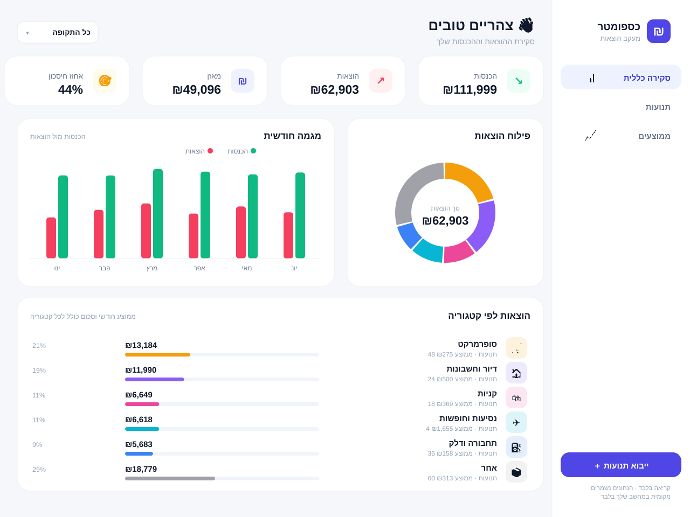

# NOVA 💎 — מעקב הוצאות והכנסות אישי

אפליקציית ווב לניהול ומעקב אחר הוצאות והכנסות מהבנק וכרטיסי האשראי, בהשראת Rise Up,
בעיצוב dark-mode טכנולוגי עם זוהר ניאון.
**קריאה בלבד** — האפליקציה לא מבצעת פעולות בחשבון, רק מציגה ומנתחת נתונים. כל המידע נשמר
מקומית על המחשב שלך ולא נשלח לשום שרת חיצוני.



## תכונות

- 📊 **דשבורד** עם מאזן, הכנסות, הוצאות ואחוז חיסכון
- 🍩 **פילוח הוצאות לפי קטגוריות** עם תרשים דונאט
- 📈 **מגמה חודשית** של הכנסות מול הוצאות
- 📉 **ממוצע הוצאה חודשי לכל קטגוריה**
- 🏷️ **סיווג אוטומטי** של תנועות לפי בית העסק + עריכה ידנית
- 🧾 **רשימת תנועות** עם חיפוש וסינון
- 📄 **ייבוא CSV** מדפי בנק / חברות אשראי
- 🏦 **חיבור אמיתי (אופציונלי)** לבנקים ישראליים דרך `israeli-bank-scrapers`
- 🇮🇱 ממשק בעברית מלא, תמיכת RTL, עיצוב מודרני

## הרצה מהירה

```bash
# התקנת כל התלויות (שורש, שרת, לקוח)
npm run install:all

# יצירת נתוני דמו כדי לראות את הדשבורד מלא
npm run seed

# הרצת השרת והלקוח יחד
npm run dev
```

לאחר מכן פתח את הדפדפן בכתובת **http://localhost:5173**

> השרת רץ על פורט 3001 והלקוח על 5173 (עם proxy ל-API).

## 📱 הרצה בטלפון

האפליקציה רספונסיבית ומותקנת כ-**PWA** (אפליקציה על מסך הבית). הנתונים נשמרים על המחשב,
לכן הטלפון ניגש למחשב דרך רשת ה-WiFi הביתי. שני המכשירים חייבים להיות על אותה רשת.

**שלב 1 — הרץ על המחשב:**
```bash
npm run dev
```
ב-Vite יודפסו שתי כתובות. שים לב לשורת **Network**, למשל:
```
➜  Local:   http://localhost:5173/
➜  Network: http://192.168.1.20:5173/   ← זו הכתובת לטלפון
```
אם לא מופיעה כתובת Network, מצא את כתובת ה-IP של המחשב:
`ipconfig` (Windows) · `ifconfig` או `ip a` (Mac/Linux) — חפש כתובת בסגנון `192.168.x.x`.

**שלב 2 — פתח בטלפון:** הקלד בדפדפן של הטלפון את כתובת ה-Network (לדוגמה `http://192.168.1.20:5173`).

**שלב 3 — התקן כאפליקציה (אופציונלי):**
- **אייפון (Safari):** כפתור שיתוף → "הוסף למסך הבית"
- **אנדרואיד (Chrome):** תפריט ⋮ → "התקן אפליקציה" / "הוסף למסך הבית"

האייקון של NOVA יופיע במסך הבית והאפליקציה תיפתח במסך מלא כמו אפליקציה רגילה.

> 💡 המחשב צריך להישאר דולק ומחובר לאותה רשת כל עוד אתה משתמש באפליקציה בטלפון.
> לחלופין, אפשר לבנות גרסת production (`npm run build`) ולפרוס לשרת/שירות אירוח כדי לגשת מכל מקום.

## ייבוא נתונים מהבנק / כרטיס אשראי

1. היכנס לאתר הבנק או חברת האשראי
2. ייצא דף תנועות בפורמט **CSV** (או Excel ושמור כ-CSV)
3. בתוך האפליקציה לחץ **"ייבוא תנועות"** וגרור את הקובץ

המערכת מזהה אוטומטית עמודות של תאריך, תיאור וסכום (בעברית או אנגלית) ומסווגת לקטגוריות.

## חיבור אוטומטי לבנק (אופציונלי)

לגישת קריאה-בלבד אוטומטית לבנקים וכרטיסי אשראי ישראליים, ניתן להתקין את הספרייה
[`israeli-bank-scrapers`](https://github.com/eshaham/israeli-bank-scrapers):

```bash
npm --prefix server install israeli-bank-scrapers
```

לאחר ההתקנה אפשר לקרוא לנקודת הקצה `POST /api/scrape` עם `companyId` ופרטי התחברות.
הספרייה תומכת בין היתר ב: הפועלים, לאומי, דיסקונט, מזרחי, ויזה כאל, מקס, ישראכרט, אמקס,
הבינלאומי, יהב, OneZero ועוד.

> ⚠️ **אבטחה**: פרטי ההתחברות מועברים לשרת המקומי בלבד ואינם נשמרים לדיסק. הרץ את
> האפליקציה רק במחשב האישי שלך. אל תכניס קובצי נתונים או פרטי התחברות לגיט (מוגדר ב-`.gitignore`).

## מבנה הפרויקט

```
.
├── server/              # שרת Express (API, קריאה בלבד)
│   ├── index.js         # נקודות קצה
│   ├── db.js            # אחסון מקומי (JSON)
│   ├── analytics.js     # חישובי סטטיסטיקה
│   ├── categories.js    # מנוע סיווג קטגוריות
│   ├── importer.js      # ניתוח CSV
│   ├── scraper.js       # אינטגרציית israeli-bank-scrapers
│   └── seed.js          # נתוני דמו
└── client/              # React + Vite + Tailwind + Recharts
    └── src/
        ├── App.tsx
        ├── api.ts
        ├── components/
        └── utils/
```

## טכנולוגיות

- **Frontend**: React 18, Vite, TypeScript, TailwindCSS, Recharts
- **Backend**: Node.js, Express
- **אחסון**: קובץ JSON מקומי (ללא תלות חיצונית)
